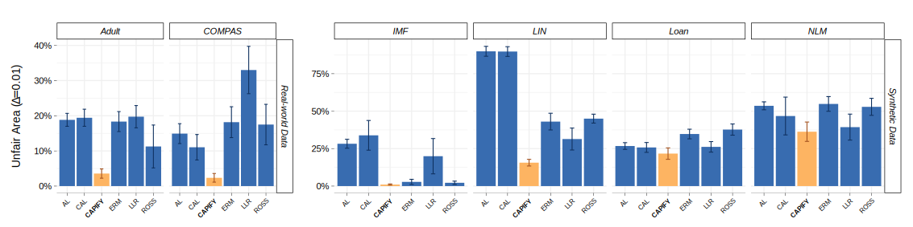

# Causal Adversarial Perturbations for Individual Fairness and Robustness in Heterogeneous Data Spaces with PyTorch

As responsible AI gains importance in machine learning algorithms, properties such as fairness, adversarial robustness, and causality have received considerable attention in recent years. However, despite their individual significance, there remains a critical gap in simultaneously exploring and integrating these properties. In this paper, we propose a novel approach that examines the relationship between individual fairness, adversarial robustness, and structural causal models in heterogeneous data spaces, particularly when dealing with discrete sensitive attributes. We use causal structural models and sensitive attributes to create a fair metric and apply it to measure semantic similarity among individuals. By introducing a novel causal adversarial perturbation and applying adversarial training, we create a new regularizer that combines individual fairness, causality, and robustness in the classifier. Our method is evaluated on both real-world and synthetic datasets, demonstrating its effectiveness in achieving an accurate classifier that simultaneously exhibits fairness, adversarial robustness, and causal awareness.

## Prequisites

Install the packages in `requirements.txt`, for instance using

```
python -m venv myenv/
source myenv/bin/activate
pip install -r requirements.txt
```

## Running the Experiments

To run the experiments, execute the following commands:

```bash
python src/run_benchmarks.py --seed 0
python src/run_benchmarks.py --seed 1
python src/run_benchmarks.py --seed 2
python src/run_benchmarks.py --seed 3
python src/run_benchmarks.py --seed 4
```

If you intend to retrain the decision-making classifiers and the structural equations, 
first delete the `models/` and `scms/` folders, and then execute `run_benchmarks.py`. This step will ensure that the benchmarks are run using the new training data. Otherwise, the script will utilize the pre-existing pretrained classifiers and structural causal models (SCMs) for the experiments.

## Numerical Study

In this study, we empirically validate the theoretical propositions presented in the paper. We assess the performance of the CAPIFY and CAL training methods in comparison to conventional empirical risk minimization (ERM) and other pertinent techniques, including Adversarial Learning (AL), Locally Linear Regularizer (LLR) training, and Ross method. Our experimentation involves real datasets, specifically Adult and COMPAS, which are pre-processed according to. Furthermore, we consider three synthetic datasets related to Linear (LIN), Non-linear (NLM), and independent futures (IMF) SCMs, along with the semi-synthetic Loan dataset.

We utilize a multi-layer perceptron with three hidden layers, each comprising 100 nodes, for the COMPAS, Adult, NLM, and Loan datasets. Logistic regression is employed for the remaining datasets. To evaluate classifier performance, we measure accuracy and Matthews correlation coefficient (MCC). Furthermore, we quantify CAPI fairness using UAI across various $\Delta$ values, including 0.05, 0.01, and 0.0. Additionally, we compute UAI for non-sensitive scenarios, employing $\Delta$ values of 0.05 and 0.01 to represent the non-robust data percentage. 

We performed our experiment using 100 different seeds.  Below illustrate that the CAPIFY method exhibits a lower unfair area ($U_\Delta$) for $\Delta = 0.05$, $\Delta = 0.01$, and $\Delta = 0.0$. 
However, the CAL method shows unsatisfactory accuracy due to the issues reported previously.
Compared to ERM, CAPIFY shows slightly lower accuracy, a trade-off noted in multiple studies. Notably, real-world data indicates a greater reduction in unfairness than in accuracy.
Moreover, CAPIFY exhibits robustness and counterfactual fairness attributes, making it the favored model when assessing both concepts.


<div style="”width:100%”">





</div>
